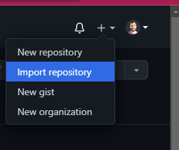
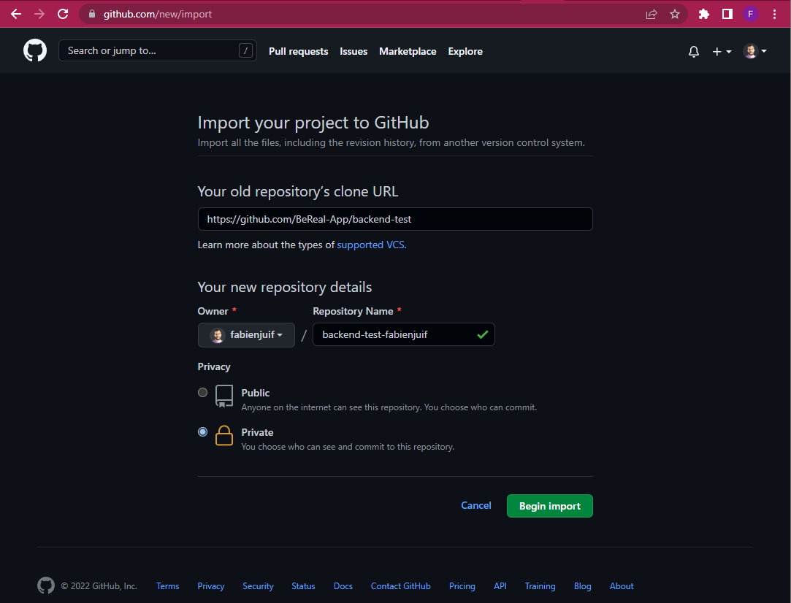
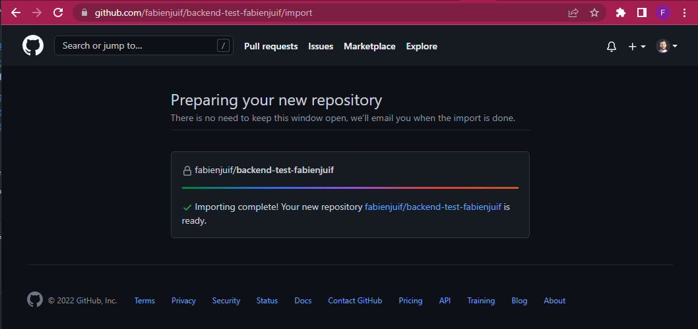
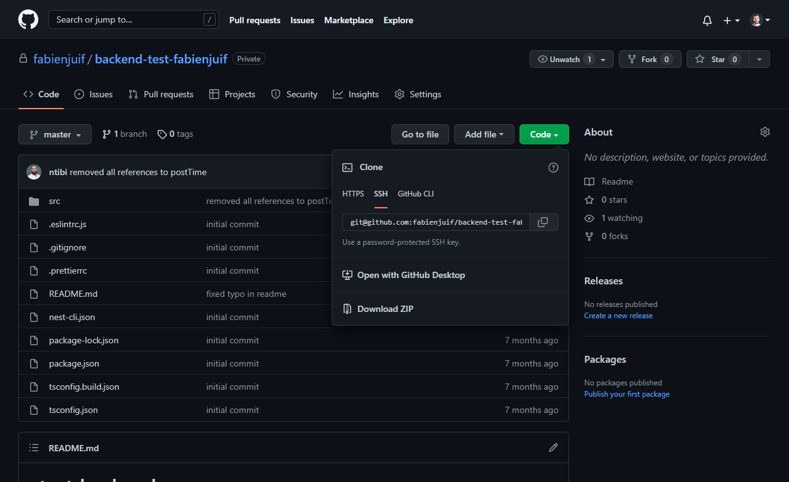
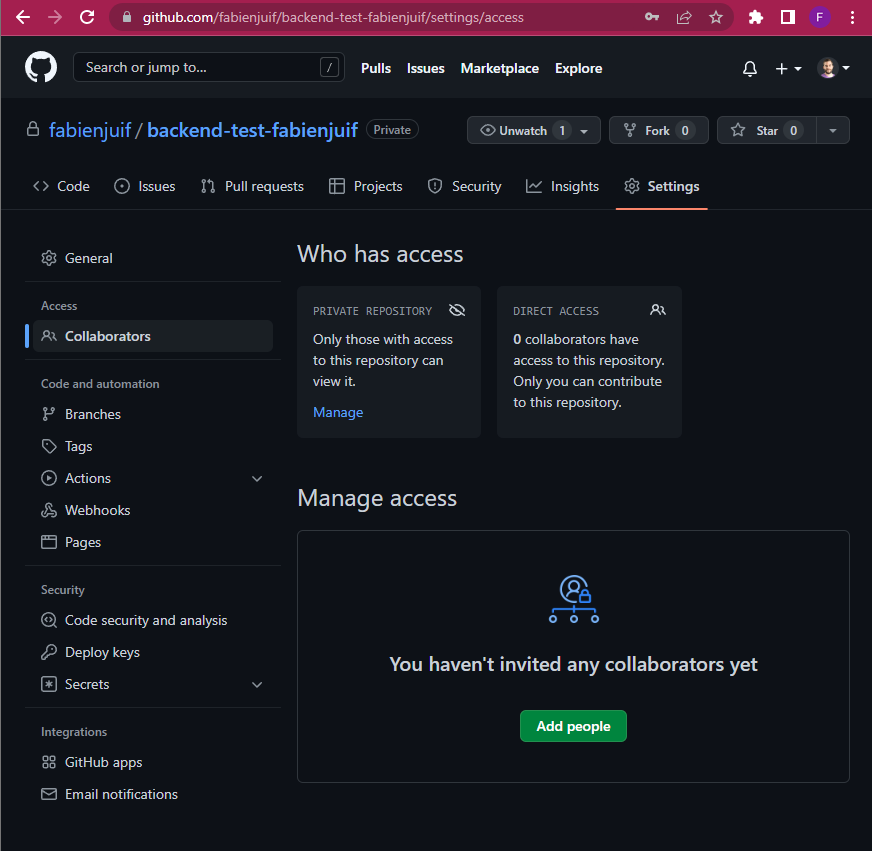

# BeReal - Share your code

You want to share your code to us so we can review it.

Please do **NOT** make it public and follow these steps:

## 1 - Fork the code in a private repository

You have to fork the current repository in your own github account as a **private** repository.

You can achieve this by using the `import` feature of github and use these values:

- **url**:`https://github.com/BeReal-Candidates/backend-go-test.git`
- **repository name**: backend-go-test-<your_github_nickname>
- **private**: true

## 2 - Clone your new repository

You can clone this new repository and push into it.

## 3 - Code ✍️

You can code, commit and push into this new repository.

## 4 - Add collaborators to your new repository [**WHEN YOU ARE READY**]

**WHEN YOU ARE READY** and want us to review your code:

You have to add these reviewers as collaborators to your repository:

- quangvoodoo
- Dmouri
- lkhouader
- maxbrlvd
- optplx

Please create a pull request for the changes that you made. Make sure to write in the description of the PR what you want us to know about your chosen approach, any bugs you have found and fixed.

Finally, don’t forget to upload your case (as a zip or GitHub link) using the second link included in the email you received about the case study.

From this stage, we considerer you have finished the task!

## 5 - Code review

The reviewers will review your code, and possibly leave some comments on your PR.
So please keep an eye on it, and answer the all the questions that the reviewers might have.

## 6 - Chill & Wait

Then it's us to reach you after the review is done.
Just chill!
